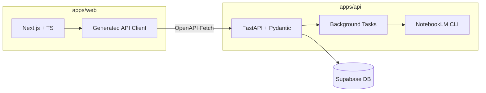

# 🚀 LinkDropV2 통합 개발 가이드

본 문서는 `nextjs-fastapi-template`의 모범 사례를 벤치마킹하여 설계된 LinkDropV2의 표준 개발 공정 및 아키텍처를 정의합니다.

---

## 1. 🏗️ 시스템 아키텍처 (Architecture)

LinkDropV2는 프론트엔드와 백엔드가 분리된 모노레포 구조를 지향하며, 데이터 스키마를 중심으로 강력한 타입 안전성을 보장합니다.



---

## 2. 📂 프로젝트 구조 (Project Structure)

```
C:\LinkDropV2
├── apps/
│   ├── api/                # FastAPI 백엔드 (Python)
│   │   ├── main.py         # 진입점 및 라우팅
│   │   ├── models/         # Pydantic 데이터 모델
│   │   └── services/       # 비즈니스 로직 (NotebookLM 연동)
│   └── web/                # Next.js 프론트엔드 (TypeScript)
│       ├── src/app/        # App Router 및 페이지
│       └── src/components/ # 재사용 가능한 UI 컴포넌트
├── packages/               # 공유 패키지 및 에이전트 툴
├── docs/                   # 개발 가이드 및 API 문서
└── docker-compose.yml      # 로컬 통합 실행 환경 (예정)
```

### 2.1. 📚 문서 지도 (Docs Map)

#### Rules
- [00 행동지침](rules/00_행동지침.md)
- [01 에이전트 정체성](rules/01_에이전트_정체성.md)
- [03 문서 출력 언어 표준](rules/03_문서_언어_표준.md)
- [10 기술 스택 및 구조](rules/10_기술_스택_및_구조.md)
- [11 명명 및 UI 표준](rules/11_명명_및_UI_표준.md)
- [20 영상 데이터 표준](rules/20_영상_데이터_표준.md)
- [30 문서 관리 지침](rules/30_문서_관리_지침.md)
- [31 운영 매뉴얼](rules/31_운영_매뉴얼.md)
- [40 DB 설계 표준](rules/40_DB_설계_표준.md)
- [50 서비스 정책 및 약관](rules/50_서비스_정책_및_약관.md)

#### Product Design
- [100 제품 요구사항 정의서(PRD)](product/100_제품_요구사항_정의서(PRD).md)
- [101 회원 관리 시스템 및 상세 리스트 설계](product/101_회원_관리_시스템_및_상세_리스트_설계.md)
- [102 영상 제작 공정 설계안](product/102_영상_제작_공정_설계안.md)
- [103 수익모델 및 정산정책](product/103_수익모델_및_정산정책.md)
- [104 콘텐츠 생산공정 설계](product/104_콘텐츠_생산공정_설계.md)
- [106 지식 선순환 공정 설계](product/106_지식_선순환_공정_설계.md)
- [106 지식창고 수집 및 분류 설계](product/106_지식창고_수집_및_분류_설계.md)
- [110 사용자 개인화 데이터 저장 및 연동 계획](product/110_사용자_개인화_데이터_저장_및_연동_계획.md)
- [111 오팔 독립 API 플랫폼 기술백서](product/111_오팔_독립_API_플랫폼_기술백서.md)
- [111 오팔 독립 API 플랫폼 아키텍처 상세설계서](product/111_오팔_독립_API_플랫폼_아키텍처_상세설계서.md)
- [111 오팔 독립 API 전략 및 구축 가이드](product/111_오팔_독립_API_전략_및_구축_가이드.md)
- [설계가이드: 오팔스킬](product/설계가이드_오팔스킬.md)
- [설계가이드: characterimage](product/설계가이드_characterimage.md)

#### Reference
- [수파베이스 연동 가이드](reference/수파베이스_연동_가이드.md)
- 참고 자료 폴더: `docs/reference/`

#### Archives
- 최근 기록: [2026-03-07 MCP Integration & 311 Plan](archives/2026-03-07_mcp_integration_and_311_plan.md)
- 진행상황: [2026-03-05 LinkDrop Opal Progress](archives/2026-03-05_LinkDrop_Opal_Progress.md)
- 전략 문서: [2026-03-02 Identity and Strategy v2](archives/2026-03-02_Identity_and_Strategy_v2.md)
- 전체 기록: `docs/archives/`

---

## 3. 🛠️ 개발 워크플로우 (Workflow)

### 3.1. 백엔드 개발 (FastAPI)
*   **패키지 관리**: `uv` 또는 `pip`를 사용한 가상환경 관리.
*   **스키마 정의**: 모든 API 요청/응답은 Pydantic 모델을 통해 정의됩니다.
*   **API 문서**: 실행 중인 서버의 `/docs` 경로에서 Swagger UI를 통해 실시간 확인 가능.

### 3.2. 프론트엔드 개발 (Next.js)
*   **타입 안전성**: 백엔드의 OpenAPI 스키마를 바탕으로 클라이언트 타입을 자동 생성합니다.
*   **UI 컴포넌트**: Tailwind CSS 및 shadcn/ui(권장)를 사용하여 일관된 미감을 유지합니다.

### 3.3. 통합 실행 (One-Command Setup)
추후 `Makefile` 또는 `docker-compose`를 통해 다음 명령으로 전체 환경을 기동합니다:
```bash
# 통합 실행 (예정)
make up 
```

---

## 4. 🔗 프론트-백엔드 연동 가이드

1.  **Backend**: `apps/api/main.py`에서 새로운 엔드포인트와 Pydantic 모델을 작성합니다.
2.  **Schema**: FastAPI가 생성한 `openapi.json`을 확인합니다.
3.  **Frontend**: 프론트엔드에서 `openapi-fetch` 등의 도구를 사용하여 백엔드 타입을 업데이트합니다.
4.  **Usage**: 생성된 타입을 사용하여 에러 없는 API 호출을 구현합니다.

---

## 🎯 향후 목표 (Roadmap)
*   **Dockerization**: 전체 시스템의 컨테이너화.
*   **E2E Type Safety**: 백엔드 모델 변경 시 프론트엔드 코드가 즉시 동기화되는 파이프라인 구축.
*   **CI/CD**: Vercel 및 GitHub Actions를 통한 자동 테스트 및 배포.

---
*최종 업데이트: 2026-03-05*
*참조: vintasoftware/nextjs-fastapi-template*
