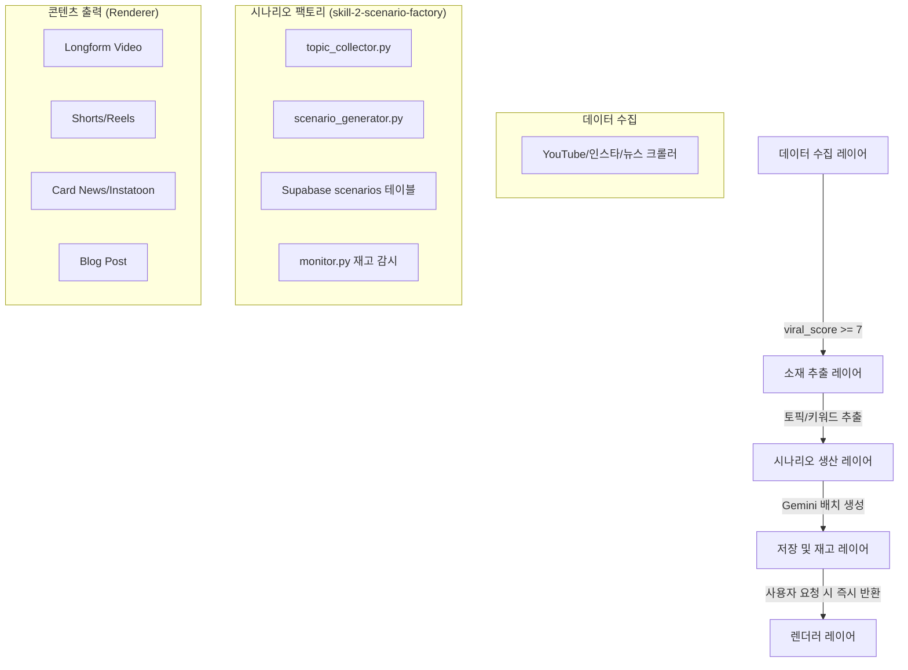

# 🏭 시나리오 공장(Scenario Factory) 설계도

이 설계도는 수집된 바이럴 데이터를 기반으로 고품질 시나리오를 대량 사전 생산하고, 이를 다양한 콘텐츠(영상, 카드뉴스, 블로그 등)의 원천 데이터(DNA)로 활용하는 '시나리오 팩토리' 시스템의 통합 지침입니다.

---

## 1. 서비스 철학 및 전략 (Scenario DNA)

- **1-Unit Precision**: 시나리오는 모든 콘텐츠의 핵심 DNA입니다. 잘 만들어진 시나리오 하나가 영상, 인스타툰, 블로그 포스트 등으로 무한 확장됩니다.
- **Lean Production**: Gemini 2.5 Flash-Lite를 사용하여 시나리오 1개당 약 1원의 저비용으로 생산하며, 실시간 생성이 아닌 '사전 생산-즉시 배달' 방식으로 사용자 경험(UX) 속도를 250배 향상시킵니다.
- **Viral-Driven**: 크롤링된 데이터 중 `viral_score >= 7`인 검증된 소재만을 사용하여 시나리오의 시장성을 확보합니다.

---

## 2. 시스템 아키텍처 (System Architecture)



---

## 3. 핵심 구성 요소 (Core Components)

### ① 소재 수집기 (Topic Collector)
- **역할**: 크롤링 DB에서 고점 데이터(7점+)를 선별하여 시나리오 씨앗(Seed)이 될 토픽을 정제합니다.
- **기능**:
  - 중복 토픽 제거 (이미 생성된 시나리오와 대조)
  - 템플릿 카테고리 자동 분류 (health, stock, tech 등)
  - `topic_pool` 테이블에 관리

### ② 시나리오 생성기 (Scenario Generator)
- **역할**: Gemini 2.5 Flash-Lite API를 사용하여 템플릿별/스타일별 시나리오를 대량 생산합니다.
- **기능**:
  - 병렬 워커(Parallel Workers)를 통한 고속 생성
  - 프롬프트 엔지니어링을 통한 'DNA' 구조화 (나레이션, 씬 묘사, 훅, 요약 포함)

### ③ 재고 관리기 (Monitor)
- **역할**: Supabase의 미사용 시나리오 재고를 실시간 감시하고 부족분 발생 시 자동 보충합니다.
- **임계값(Threshold)**:
  - 템플릿별 초기 목표: 200개
  - 최소 유지 재고: 30개
  - 보충 수량: 50개

---

## 4. 데이터베이스 설계 (Supabase)

### `topic_pool` 테이블 (소재 관리)
| 필드명 | 타입 | 설명 |
| :--- | :--- | :--- |
| id | UUID | 기본키 |
| topic | TEXT | 정제된 핵심 주제 |
| template_id | TEXT | 연결된 템플릿 ID |
| viral_score | FLOAT | 원천 데이터의 바이럴 점수 |
| used | BOOLEAN | 시나리오 생성 완료 여부 |

### `scenarios` 테이블 (시나리오 자산)
| 필드명 | 타입 | 설명 |
| :--- | :--- | :--- |
| id | UUID | 기본키 |
| template_id | TEXT | 템플릿 카테고리 |
| style | TEXT | 시나리오 스타일 (ranking, story 등) |
| topic | TEXT | 주제 |
| script | TEXT | 전체 스크립트 (나레이션) |
| scenes_json | JSONB | 씬별 상세 데이터 (텍스트, 묘사) |
| hook | TEXT | 첫 씬의 강렬한 문구 |
| used | BOOLEAN | 사용자 배송 완료 여부 |
| created_at | TIMESTAMPTZ | 생성 일시 |

---

## 5. 기술 스택 및 파일 구조

**Skill ID**: `skill-2-scenario-factory`

```text
C:\LinkDropV2\packages\tools\skill-2-scenario-factory\
├── manifest.json            # 스킬 메타데이터 (05_시나리오_팩토리_에이전트)
├── logic.py                 # 메인 진입점 (factory.py 역할)
├── topic_collector.py       # 크롤 데이터 → 토픽 정제
├── scenario_generator.py    # Gemini API 연동 생성 엔진
├── supabase_client.py       # Supabase CRUD 연동
├── drive_client.py          # 원본 데이터 백업 (Google Drive)
├── monitor.py               # 재고 감시 백그라운드 루프
└── config/
    ├── production_config.json # 생산량, 재고 임계값, 병렬 수 제어
    └── prompt_config.json     # 템플릿별 페르소나 및 프롬프트 설정
```

---

## 6. 생산 제어판 (production_config.json)

사용자는 이 파일의 설정값만 수정하여 공장의 가동 방식을 제어합니다.

```json
{
  "targets": {
    "initial_count_per_template": 200,
    "min_stock_threshold": 30,
    "replenish_count": 50
  },
  "generation": {
    "parallel_workers": 20,
    "temperature": 0.75
  },
  "topic_source": {
    "min_viral_score": 7.0,
    "max_topic_age_days": 90
  }
}
```

---

## 7. 향후 확장 (Renderer Layer)

Supabase에 저장된 하나의 시나리오 DNA는 다음과 같이 확장됩니다:
1. **영상**: scenes_json → TTS → 이미지 생성 → FFmpeg (현재 구현됨)
2. **카드뉴스**: scenes_json → 템플릿 HTML → Puppeteer PNG (Phase 3)
3. **블로그**: script → Gemini 확장 → Markdown 포스팅 (Phase 3)
4. **인스타툰**: scenes_json → 캐릭터 일관성 이미지 생성 (Phase 4)

---
*본 설계도는 시나리오 로직1.md 및 시나리오 로직2.md의 내용을 통합하여 작성되었습니다.*
